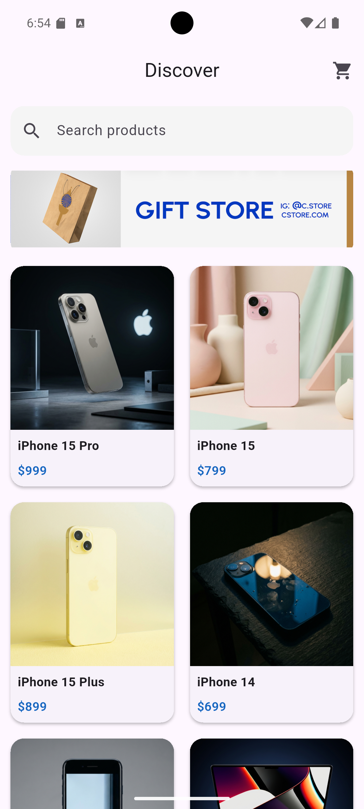
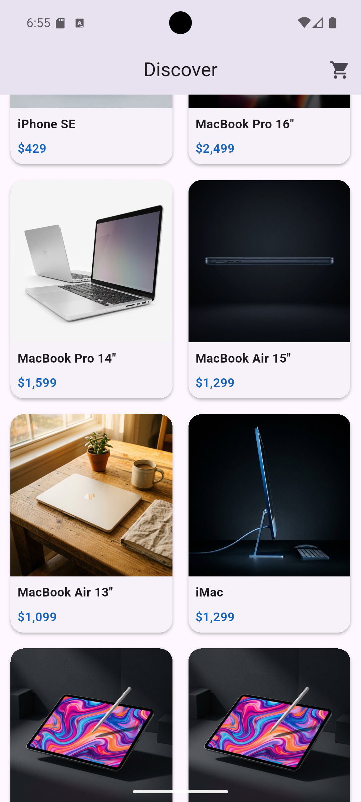
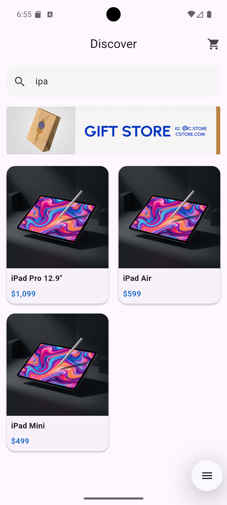
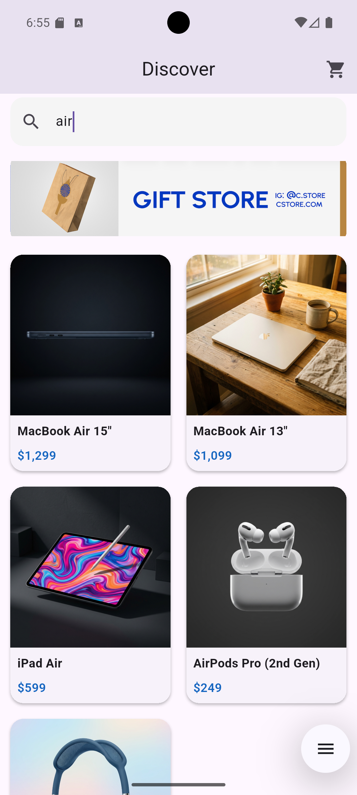
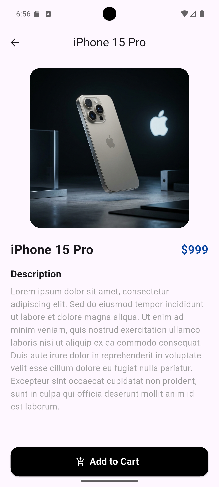
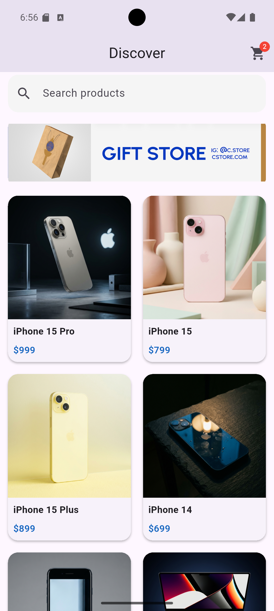
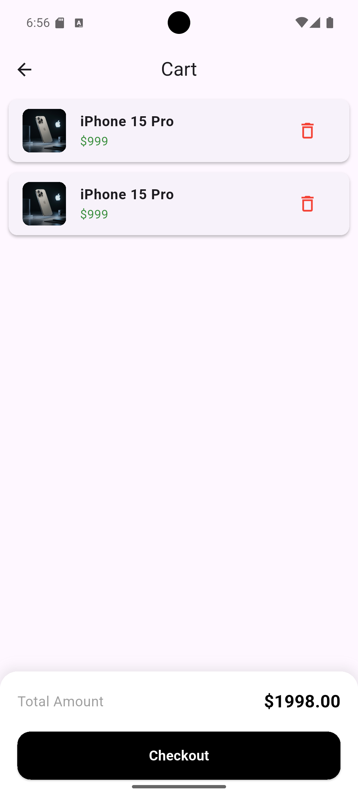
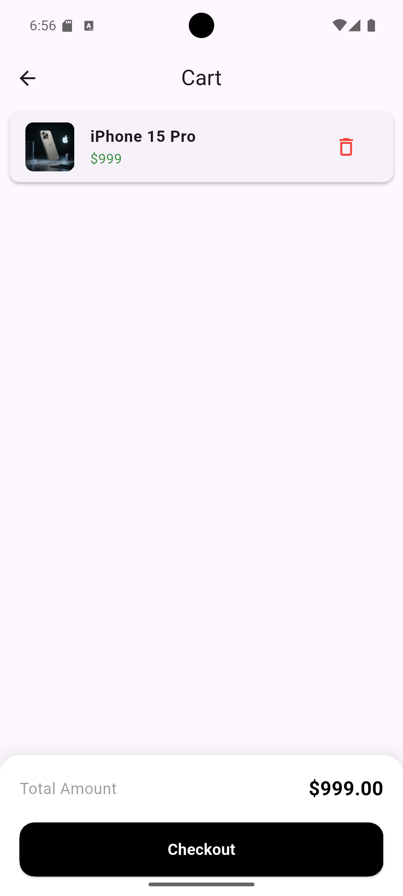

# Mini Katalog Uygulaması


## Proje Hakkında

Mini Katalog Uygulaması, Flutter kullanılarak geliştirilmiş basit bir mobil katalog uygulamasıdır.
Bu proje kapsamında Flutter'ın temel yapı taşları olan widget yapısı, sayfa navigasyonu, veri listeleme ve temel kullanıcı arayüzü tasarımı uygulanmıştır.

Uygulamada kullanıcılar ürünleri listeleyebilir, arama yapabilir, ürün detaylarını görüntüleyebilir ve ürünleri sepete ekleyebilir.

Bu proje eğitim amaçlı geliştirilmiştir.

---

## Özellikler

* Ürün listeleme (GridView)
* Ürün detay sayfası
* Ürün arama
* Sepete ürün ekleme
* Sepet sayfası
* Sepetten ürün silme
* Toplam fiyat hesaplama
* Banner görseli kullanımı
* Flutter navigation sistemi kullanımı

---

## Kullanılan Teknolojiler

* Flutter
* Dart
* Material UI Widgets

---

## Flutter Sürümü

Proje aşağıdaki Flutter sürümü ile geliştirilmiştir:

Flutter  3.41.4
Dart 3.11.1

---

## Proje Yapısı

```
lib/
 ├── main.dart
  └── Uygulamanın başlangıç noktasıdır. Ana sayfa, ürün listesi ve arama işlemleri burada tanımlanır.
 ├── product_detail.dart
  └── Seçilen ürünün detaylarının gösterildiği sayfayı içerir.
 ├── cart.dart
  └── Kullanıcının sepete eklediği ürünlerin listelendiği ve toplam fiyatın hesaplandığı sayfadır.
assets/
 └── images/
     └── banner.png
```

---

## Kurulum ve Çalıştırma

Projeyi kendi bilgisayarınızda çalıştırmak için aşağıdaki adımları izleyebilirsiniz.

### 1. Repository'i klonlayın

```
git clone https://github.com/skmelisa/mini_katalog.git
```

### 2. Proje klasörüne girin

```
cd mini_katalog
```

### 3. Gerekli paketleri yükleyin

```
flutter pub get
```

### 4. Uygulamayı çalıştırın

```
flutter run
```

---

## Ekran Görüntüleri

### Ana Sayfa

 

### Arama Butonu

 

### Ürün Detay Sayfası



### Sepet Sayfası

 

### Sepette Ürün Silme



---

## Veri Kaynakları

Bu projede kullanılan görseller ve veri kaynakları eğitim amaçlıdır.

Banner görseli:
https://wantapi.com/assets/banner.png

Ürün verileri:
https://wantapi.com/products.php

---

## Amaç

Bu proje, Flutter ile mobil uygulama geliştirmeye giriş seviyesinde bir örnek oluşturmak amacıyla hazırlanmıştır.
Widget yapısı, sayfa geçişleri, veri modelleme ve temel UI geliştirme süreçlerini öğretmeyi hedeflemektedir.

---

## Geliştirici

MSK
